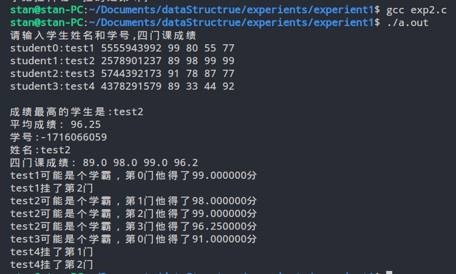
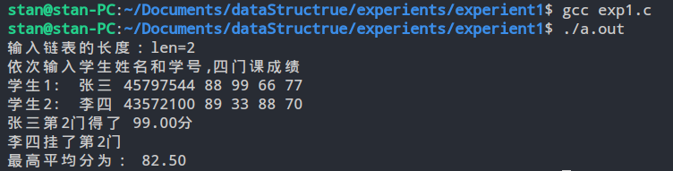

## 实验名称：C语言基础练习

##### 计算机166班 李彪 6130116194 2017/11/6

---
### 一、实验目的
对C语言的复习，增强学生对结构体数组和指针的学习，尤以结构体的应用和指针的操作作为重点。
### 二、问题描述
1. 构造一个学生结构体，成员包括学号，姓名，四门成绩，以及平均成绩；
2. 从键盘上输入学生的学号，姓名和四门成绩；
3. 找出学生中考试没有通过的学生姓名并输出；找出考试在90分以上的学生并输出。
### 三、实验要求
1. 要求分别用数组和链表存储学生的记录，并设计出输入和查找的基本操作算法。
2. 在实验过程中，分析算法的时间复杂度和空间复杂度进行分析 
###  四、实验环境
* PC微机
* debian linux操作系统
* 编译器：gcc(GNU CCompiler)
* 实现语言：C
### 五、实验步骤
1. 使用数组存储学生记录：
代码：（注释部分）
<pre style="font-size:10px;padding:0 20px">
#include <stdio.h>
typedef struct Student
{
    int num;
    char name[20];
    float score[3];
    float aver;
} Student;//定义结构体Student
int main()
{
    void input(Student stu[]);
    Student max(Student stu[]);
    void print(Student stu);
    void query_student(Student stu[]);
    Student stu[4], *p = stu;//创建结构体数组，指针ｐ指向stu数组
    input(p);//p指向stu
    print(max(p));
    query_student(p);
    return 0;
}
void input(Student stu[])//获取学生信息
{
    int i, k;
    printf("请输入学生姓名和学号,四门课成绩\n");
    for (i = 0; i < 4; i++)
    {
        printf("student%d:", i);
        scanf("%s", stu[i].name);
        scanf("%d", &stu[i].num);
        for (k = 0; k < 4; k++)
        {
            scanf("%f", &stu[i].score[k]);
        }
        stu[i].aver = (stu[i].score[0] + stu[i].score[1] + stu[i].score[2] + stu[i].score[3]) / 4.0;
    }
}
Student max(Student stu[])//根据学生平均成绩来查找成绩最高的学生
{
    int i, m;
    for (i = 0; i < 5; i++)
    {
        if (stu[i].aver > stu[m].aver)
        {
            m = i;
        }
    }
    printf("\n成绩最高的学生是:%s\n", stu[m].name);
    printf("平均成绩:%6.2f\n", stu[m].aver);
    return stu[m];
}
void query_student(Student stu[])//查询不及格的学生以及有超过了90分的学生
{
    int j, k;
    for (j = 0; j < 4; j++)
    {
        for (k = 0; k < 4; k++)
        {
            if (stu[j].score[k] < 60)
            {
                printf("%s挂了第%d门\n", stu[j].name,k);
            }
            else if (stu[j].score[k] > 90)
            {
                printf("%s可能是个学霸，第%d门他得了%f6.2分\n",stu[j].name,k,stu[j].score[k]);
            }
        }
    }
}
void print(Student stu)
{
    printf("学号:%d\n姓名:%s\n四门课成绩:%5.1f%5.1f%5.1f%5.1f\n", stu.num, stu.name, stu.score[0], stu.score[1], stu.score[2], stu.score[3]);
}
</code></pre>
使用gcc编译成功，生成a.out可执行文件，之后执行该文件，依次输入数据
执行结果：

1. 使用链表操作：
代码：
<pre style="font-size:10px;padding:0 20px">
// C实现连式结构
#include <stdio.h>
#include <malloc.h>
#include <stdbool.h>
#include <stdlib.h>

typedef struct Node
{
    int num;
    char name[6];
    float grade[3];
    float averge;
    struct Node *next; //指针域
} Node, *PNode;
/** 
**创建链表 
**这里使用了一次性创建，可以考虑将创建节点的部分抽离出一个单独的函数
*/
PNode create_list()
{
    int len, i;
    printf("输入链表的长度：len=");
    scanf("%d", &len);
    PNode PHead = malloc(sizeof(Node));
    PHead->next = NULL;
    PNode PTail = PHead; //PTail是永远指向尾节点的指针
    printf("依次输入学生姓名和学号,四门课成绩\n");
    for (i = 0; i < len; i++)
    {
        PNode PNew = malloc(sizeof(Node));
        printf("学生%d:\t", i + 1);
        scanf("%s", &PNew->name);
        scanf("%d", &PNew->num);
        float total = 0;
        for (int j = 0; j < 4; j++)
        {
            scanf("%f", &PNew->grade[j]);
            total = total + PNew->grade[j];
        }
        PNew->averge = (total / 4.0);
        PNew->next = NULL;
        PTail->next = PNew;
        PTail = PNew;
    }
    return PHead;
}

void get_best(PNode pHead)//获取90分以上以及不及格的信息
{
    PNode p = pHead->next;
    float best = 0;
    while (p != NULL)
    {
        int total = 0;
        if (p->averge > best)
        {
            best = p->averge;
        }
        for (int k = 0; k < 4; k++)
        {
            if (p->grade[k] < 60)
            {
                printf("%s挂了第%d门\n", p->name, k + 1);
            }
            else if (p->grade[k] > 90)
            {
                printf("%s第%d门得了%6.2f分\n", p->name, k + 1, p->grade[k]);
            }
        }
        p = p->next;
    }
    printf("最高平均分为：%6.2f", best);
    printf("\n");
}
int main()
{
    PNode PHead = create_list();//创建链表
    get_best(PHead);查询信息
    return 0;
}

</pre>
运行结果及调试过程：

### 六：反思：
对于结构体的相关基础掌握的不够牢固，对结构体的定义方式不是很理解

Q：用struct和typedef struct 定义一个结构体有什么区别？为什么会有两种方式呢？
A:事实上，这个东西是从C语言中遗留过来的，typedef可以定义新的复合类型或给现有类型起一个别名，在C语言中，如果你使用 struct xxx {...}; 的方法，使用时就必须用struct xxx var 来声明变量，而使用 typedef struct {...}的方法 就可以写为xxx var;
不过在C++中已经没有这回事了，无论你用哪一种写法都可以使用第二种方式声明变量，这个应该算是C语言的糟粕。
### 七、思考题
一个包含100个元素的数组，每个元素的值都是实数，请写出求最大元素的值及其位置的算法。

这里给出算法(使用JavaScript实现)：
<pre style="font-size:10px;padding:0 20px">
getbig(a){
    let big=a[0];
    let pos=[0];
    for(int i=0;i<100;i++){
        if(a[i]<a[i+1]>){
            big=a[i+1]
            pos.length=0
            pos.push(i+1)  
        }
        else if(a[i]=a[i+1]){
            pos.push(i+1)
        }
    }
    let info={
        thebiggest:big,
        bigpostion:pos;
    }
    return info;
}
</pre>
实现思路：假定第一个数即为最大，开始循环，如果有比之前的更大的数，就将之前所存的位置信息清掉之后插入新的位置信息，如果是跟之前所得的一样大，就推入数组。循环结束，构造一个对象，返回。